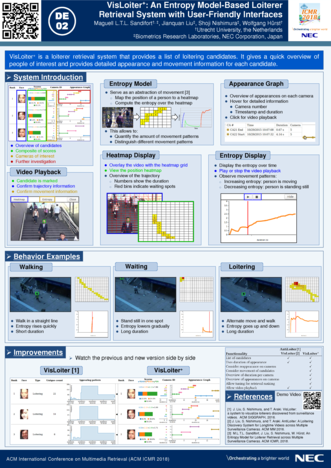

# VisLoiter+
The demo video of VisLoiter+ published at ICMR 2018

## About VisLoiter+

VisLoiter+ [1] is a loiterer retrieval system that provides a list of loitering candidates. It gives a quick overview of people of interest and provides detailed appearance and movement information for each candidate.

In the system, we introduce an entropy model [2] for loiterer retrieval. The resulting entropy serves as a measure for the amount of movement patterns. This entropy is then combined with reappearance and duration to compute a loitering score.

For more details, please refer to the following demo video and posters.

## DEMO Video

## Posters

## References

- [1] Maguell L.T.L. Sandifort, Jianquan Liu, Shoji Nishimura, Wolfgang Hürst: VisLoiter+: An Entropy Model-Based Loiterer Retrieval System with User-Friendly Interfaces. *ACM ICMR 2018* (**Demo Paper**). [PDF](http://jqliu.gitlab.io/nec-uu/ref-pdf/icmr18-demo.pdf)
- [2] Maguell L.T.L. Sandifort, Jianquan Liu, Shoji Nishimura, Wolfgang Hürst: An Entropy Model for Loiterer Retrieval across Multiple Surveillance Cameras. *ACM ICMR 2018* (**Full Paper**). [PDF](http://jqliu.gitlab.io/nec-uu/ref-pdf/icmr18-full.pdf)
